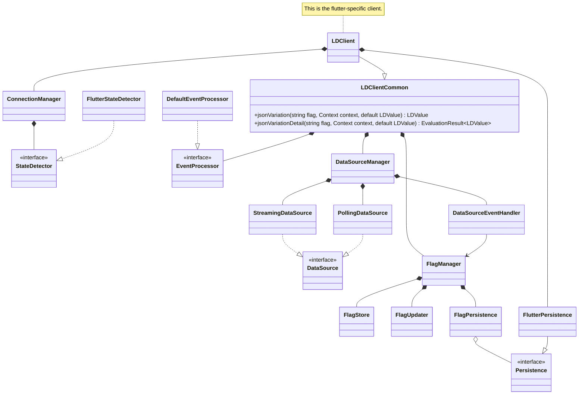

# High Level Architecture

```mermaid
classDiagram
direction

class LDClientCommon {
+jsonVariation(string flag, Context context, default LDValue) LDValue
+jsonVariationDetail(string flag, Context context, default LDValue) EvaluationResult~LDValue~
}

class DataSource {
<<interface>>
}


class StateDetector {
<<interface>>
}

class EventProcessor {
<<interface>>
}

class Persistence {
<<interface>>
}


class DataSourceManager

class StreamingDataSource

class PollingDataSource

class FlagManager

class FlagStore

class FlagUpdater

class FlagPersistence

class DataSourceEventHandler

class ConnectionManager


note for LDClient "This is the flutter-specific client."
class LDClient

class FlutterPersistence

ConnectionManager *-- StateDetector

LDClient *-- ConnectionManager

DefaultEventProcessor ..|> EventProcessor
FlutterStateDetector ..|> StateDetector

FlagPersistence o-- Persistence
FlutterPersistence --|> Persistence
LDClient *-- FlutterPersistence

LDClientCommon *-- EventProcessor
LDClientCommon *-- DataSourceManager
LDClientCommon *-- FlagManager

FlagManager *-- FlagPersistence
FlagManager *-- FlagUpdater
FlagManager *-- FlagStore

StreamingDataSource ..|> DataSource
PollingDataSource ..|> DataSource
DataSourceManager *-- PollingDataSource
DataSourceManager *-- StreamingDataSource
DataSourceManager *-- DataSourceEventHandler
DataSourceEventHandler --> FlagManager


LDClient --|> LDClientCommon

```