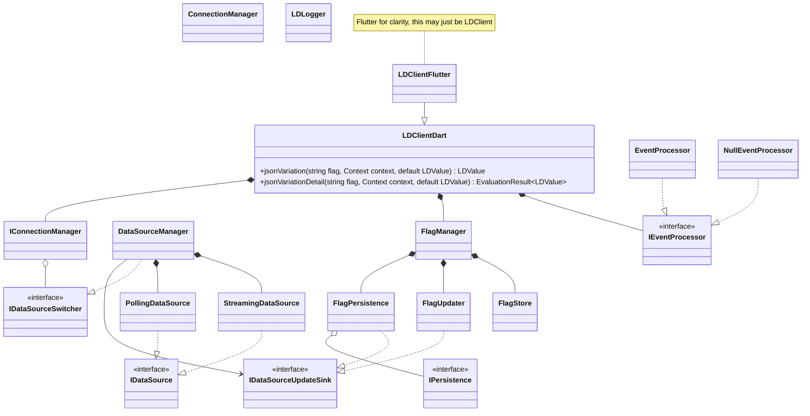

# High Level Architecture

```mermaid
classDiagram
direction TB

class LDClientDart {
  +jsonVariation(string flag, Context context, default LDValue) LDValue
  +jsonVariationDetail(string flag, Context context, default LDValue) EvaluationResult~LDValue~
}

class IDataSourceUpdateSink {
  <<interface>>
}

class IDataSource {
  <<interface>>
}

class IEventProcessor {
  <<interface>>
}

class IDataSourceSwitcher {
  <<interface>>
}

class IPersistence {
  <<interface>>
}


class ConnectionManager
class DataSourceManager


class StreamingDataSource

class PollingDataSource

class FlagManager


class FlagStore

class FlagUpdater

class FlagPersistence

class LDLogger

class EventProcessor

class NullEventProcessor

note for LDClientFlutter "Flutter for clarity, this may just be LDClient"
class LDClientFlutter

EventProcessor ..|> IEventProcessor
NullEventProcessor ..|> IEventProcessor

%% LDClientDart *-- LDLogger
%% EventProcessor o-- LDLogger
%% FlagManager o-- LDLogger
%% PollingDataSource o-- LDLogger
%% StreamingDataSource o-- LDLogger


FlagPersistence o-- IPersistence

FlagUpdater ..|> IDataSourceUpdateSink
LDClientDart *-- IConnectionManager
DataSourceManager --> IDataSourceUpdateSink
DataSourceManager ..|> IDataSourceSwitcher
FlagPersistence ..|> IDataSourceUpdateSink
IConnectionManager o-- IDataSourceSwitcher


LDClientDart *-- FlagManager
LDClientDart *-- IEventProcessor

FlagManager *-- FlagPersistence
FlagManager *-- FlagUpdater
FlagManager *-- FlagStore

StreamingDataSource ..|> IDataSource
PollingDataSource ..|> IDataSource
DataSourceManager *-- PollingDataSource
DataSourceManager *-- StreamingDataSource


LDClientFlutter --|> LDClientDart


```