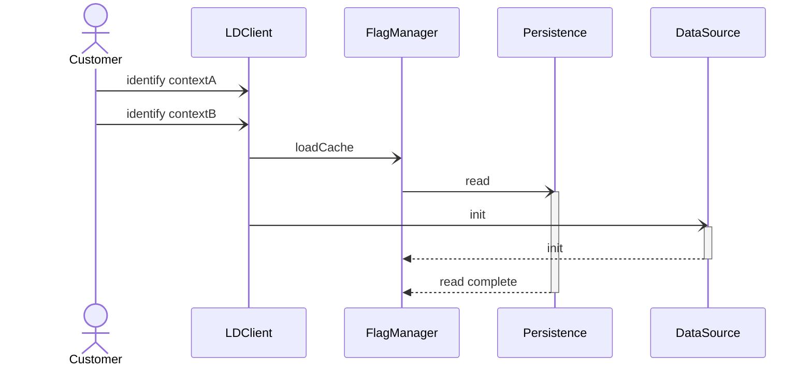

# Identify Process

```mermaid
sequenceDiagram

actor Customer

participant LDClient

participant FlagManager

participant Persistence

participant DataSource

Customer-)LDClient: identify contextA
Customer-)LDClient: identify contextB

LDClient-)FlagManager: loadCache


FlagManager-)Persistence: read
activate Persistence

LDClient-)DataSource: init
activate DataSource

DataSource-->>FlagManager: init
deactivate DataSource

Persistence-->>FlagManager: read complete
deactivate Persistence


```
